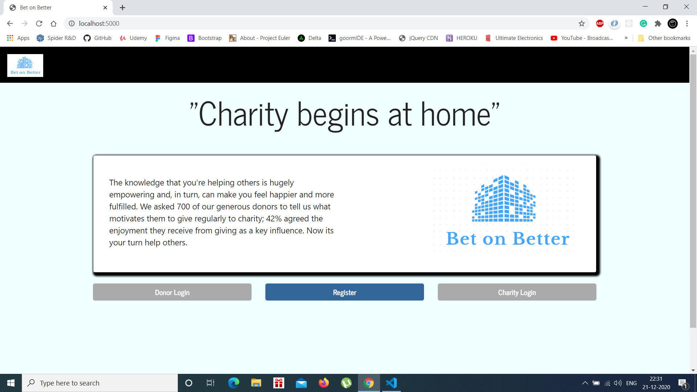
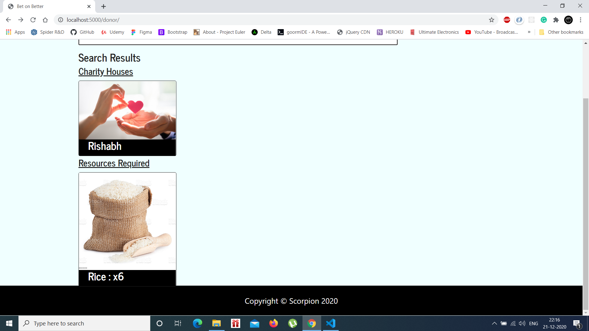
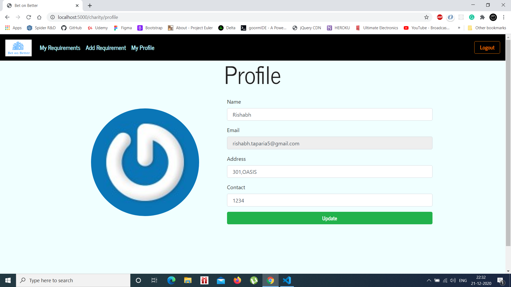

# Bet on Better
A website which facilitates the process of donating materials to needy people around one's neighborhood. Check out the site **[here](https://bet-on-better.herokuapp.com/).**

## Idea:
We strongly believe in the idea of charity begins at home. In other words, it commences in the near neighborhoods of a person. One first comes forward to help his neighbors, needy people in surroundings in the very beginning. Afterward, he extends his same helping hand to the distant places, where thousands of the needy and the weak people await his help and sympathy. 

## Overview:
At our interface, a donor is free to donate the stuff he wants to the nearest neighborhood possible. The charity organization can add or update a request for a donation. There is no restriction on materials a donor can donate. It can be old goods, clothes, food, etc.

## Execution:
### HOME:  

 <br> 

  <br>

  <br>  


### DONOR:
A donor dashboard, where users can search for necessary requirements related to the materials they are willing to donate. They can also locate the charity organizations and get to know their requirements.  
  
 <br>  
 <br>  
 <br>

### CHARITY:  
A charity dashboard, where NGOs or other organizations can update their needs, according to which the materials from willing donors will be supplied to them.  
   
 <br>  
 <br>  
 <br>  

## Technology Stack:
**FRONTEND:** HTML5, CSS3, Bootstrap, Javascript , EJS Templates  
**BACKEND:** NodeJS, ExpressJS, MongoDB

## Instructions: 
- Clone the repo
- Create a .env file by adding the required details given in .env.example 
- ```npm i``` to install the dependencies
- ```node index.js``` to start the server on localhost:5000

## Contributors:
- [Arnav Menon](https://github.com/arnavmenon)
- [Deepanshu Dhruw](https://github.com/devblin)
- [Subramanian V V](https://github.com/subramanian-vv)
- [Mansi Bisen](https://github.com/Mansibisen)
- [Rishabh Taparia](https://github.com/rt1301)